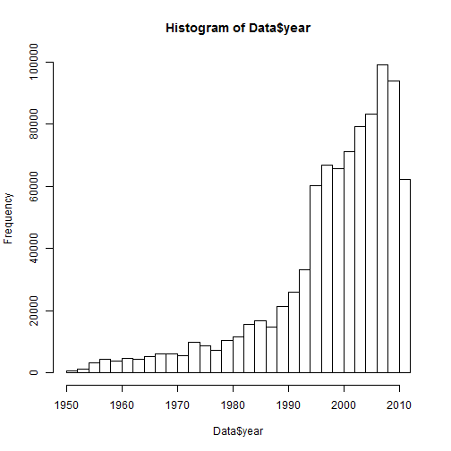
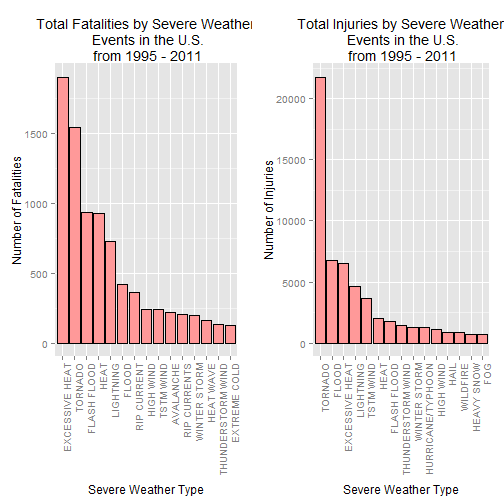
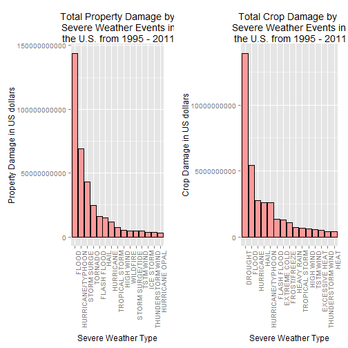

# Impact of severe weather on the economy and public health in the united states

## Synopsis
This report presents an analysis of the impact of severe weather events on public health and economy based on the storm database collected from the U.S. National Oceanic and Atmospheric Administration's (NOAA) from 1950 - 2011. Estimates of fatalities, injuries, property and crop damage are used to decide which types of events are most harmful to the population health and economy. The analysis shows that excessive heat and tornados have the highest impact on population health, while flood, drought, and hurricane/typhoon have the greatest economic consequences.

### Basic settings

```r
echo = TRUE  # make code visible
options(scipen = 1)  # Turn off scientific notations for numbers
library(R.utils)
```

```
## Warning: package 'R.utils' was built under R version 3.0.3
```

```
## Loading required package: R.oo
## Loading required package: R.methodsS3
## R.methodsS3 v1.6.1 (2014-01-04) successfully loaded. See ?R.methodsS3 for help.
## R.oo v1.18.0 (2014-02-22) successfully loaded. See ?R.oo for help.
## 
## Attaching package: 'R.oo'
## 
## The following objects are masked from 'package:methods':
## 
##     getClasses, getMethods
## 
## The following objects are masked from 'package:base':
## 
##     attach, detach, gc, load, save
## 
## R.utils v1.32.4 (2014-05-14) successfully loaded. See ?R.utils for help.
## 
## Attaching package: 'R.utils'
## 
## The following object is masked from 'package:utils':
## 
##     timestamp
## 
## The following objects are masked from 'package:base':
## 
##     cat, commandArgs, getOption, inherits, isOpen, parse, warnings
```

```r
library(ggplot2)
```

```
## Warning: package 'ggplot2' was built under R version 3.0.3
```

```r
library(plyr)
```

```
## Warning: package 'plyr' was built under R version 3.0.3
```

```r
require(gridExtra)
```

```
## Loading required package: gridExtra
```

```
## Warning: package 'gridExtra' was built under R version 3.0.3
```

```
## Loading required package: grid
```


## Data processing
This section of code is used to download, unzip and read the data. 


```r
if(!file.exists("data.csv")) {
  # Download
  url<-"http://d396qusza40orc.cloudfront.net/repdata%2Fdata%2FStormData.csv.bz2"
  download.file(url,"data.bz2")
  
  # Unzip
  zz <- readLines(gzfile("data.bz2"))
  zz <- iconv(zz, "latin1", "ASCII", sub="")
  writeLines(zz, "data.csv")
  rm(zz)
  }
 
  # Read data
  Data<-read.csv("data.csv", sep=",", quote = "\"", header=TRUE)
  dim(Data)
```

```
## [1] 902297     37
```

```r
  head(Data, n = 2)
```

```
##   STATE__          BGN_DATE BGN_TIME TIME_ZONE COUNTY COUNTYNAME STATE
## 1       1 4/18/1950 0:00:00     0130       CST     97     MOBILE    AL
## 2       1 4/18/1950 0:00:00     0145       CST      3    BALDWIN    AL
##    EVTYPE BGN_RANGE BGN_AZI BGN_LOCATI END_DATE END_TIME COUNTY_END
## 1 TORNADO         0                                               0
## 2 TORNADO         0                                               0
##   COUNTYENDN END_RANGE END_AZI END_LOCATI LENGTH WIDTH F MAG FATALITIES
## 1         NA         0                        14   100 3   0          0
## 2         NA         0                         2   150 2   0          0
##   INJURIES PROPDMG PROPDMGEXP CROPDMG CROPDMGEXP WFO STATEOFFIC ZONENAMES
## 1       15    25.0          K       0                                    
## 2        0     2.5          K       0                                    
##   LATITUDE LONGITUDE LATITUDE_E LONGITUDE_ REMARKS REFNUM
## 1     3040      8812       3051       8806              1
## 2     3042      8755          0          0              2
```

There are 902297 rows and 37 columns in total.
The events in the database start in the year 1950 and end in November 2011. In the earlier years of the database there are generally fewer events recorded, while records of recent years are complete. Therefore, only recent years are considered in the analysis.


```r
if (dim(Data)[2] == 37) {
    Data$year <- as.numeric(format(as.Date(Data$BGN_DATE, format = "%m/%d/%Y %H:%M:%S"), "%Y"))
}
hist(Data$year, breaks = 30)
```

 

The above histogram shows that the number of events recorded starts to increase significantly from 1995. Accordingly, the subset of the data from 1990 to 2011 is considered in the analysis. 

```r
storm <- Data[Data$year >= 1995, ]
dim(storm)
```

```
## [1] 681500     38
```
Now, there are 681500 rows and 38 columns in total.

#### Impact on health
In this section, the number of **fatalities** and **injuries** that are caused by the severe weather events are studied. The 15 most severe types of weather events are looked at. 


```r
sortHelper <- function(fieldName, top = 15, dataset = Data) {
    index <- which(colnames(dataset) == fieldName)
    field <- aggregate(dataset[, index], by = list(dataset$EVTYPE), FUN = "sum")
    names(field) <- c("EVTYPE", fieldName)
    field <- arrange(field, field[, 2], decreasing = T)
    field <- head(field, n = top)
    field <- within(field, EVTYPE <- factor(x = EVTYPE, levels = field$EVTYPE))
    return(field)
}

fatalities <- sortHelper("FATALITIES", dataset = storm)
injuries <- sortHelper("INJURIES", dataset = storm)
```

#### Impact on economy
To study the impact on economy, the variables **property damage** and **crop damage** are chosen for the analysis. The data is converted first into comparable numerical forms according to the meaning of units described in the code book ([Storm Events](http://ire.org/nicar/database-library/databases/storm-events/)). Both `PROPDMGEXP` and `CROPDMGEXP` columns record a multiplier for each observation where we have Hundred (H), Thousand (K), Million (M) and Billion (B).


```r
convertHelper <- function(dataset = storm, fieldName, newFieldName) {
    totalLen <- dim(dataset)[2]
    index <- which(colnames(dataset) == fieldName)
    dataset[, index] <- as.character(dataset[, index])
    logic <- !is.na(toupper(dataset[, index]))
    dataset[logic & toupper(dataset[, index]) == "B", index] <- "9"
    dataset[logic & toupper(dataset[, index]) == "M", index] <- "6"
    dataset[logic & toupper(dataset[, index]) == "K", index] <- "3"
    dataset[logic & toupper(dataset[, index]) == "H", index] <- "2"
    dataset[logic & toupper(dataset[, index]) == "", index] <- "0"
    dataset[, index] <- as.numeric(dataset[, index])
    dataset[is.na(dataset[, index]), index] <- 0
    dataset <- cbind(dataset, dataset[, index - 1] * 10^dataset[, index])
    names(dataset)[totalLen + 1] <- newFieldName
    return(dataset)
}

storm <- convertHelper(storm, "PROPDMGEXP", "propertyDamage")
```

```
## Warning: NAs introduced by coercion
```

```r
storm <- convertHelper(storm, "CROPDMGEXP", "cropDamage")
```

```
## Warning: NAs introduced by coercion
```

```r
names(storm)
```

```
##  [1] "STATE__"        "BGN_DATE"       "BGN_TIME"       "TIME_ZONE"     
##  [5] "COUNTY"         "COUNTYNAME"     "STATE"          "EVTYPE"        
##  [9] "BGN_RANGE"      "BGN_AZI"        "BGN_LOCATI"     "END_DATE"      
## [13] "END_TIME"       "COUNTY_END"     "COUNTYENDN"     "END_RANGE"     
## [17] "END_AZI"        "END_LOCATI"     "LENGTH"         "WIDTH"         
## [21] "F"              "MAG"            "FATALITIES"     "INJURIES"      
## [25] "PROPDMG"        "PROPDMGEXP"     "CROPDMG"        "CROPDMGEXP"    
## [29] "WFO"            "STATEOFFIC"     "ZONENAMES"      "LATITUDE"      
## [33] "LONGITUDE"      "LATITUDE_E"     "LONGITUDE_"     "REMARKS"       
## [37] "REFNUM"         "year"           "propertyDamage" "cropDamage"
```

```r
options(scipen=999)
property <- sortHelper("propertyDamage", dataset = storm)
crop <- sortHelper("cropDamage", dataset = storm)
```

### Results
The lists below present the impact of storms on health in terms of fatalities and injuries. 

```r
fatalities
```

```
##               EVTYPE FATALITIES
## 1     EXCESSIVE HEAT       1903
## 2            TORNADO       1545
## 3        FLASH FLOOD        934
## 4               HEAT        924
## 5          LIGHTNING        729
## 6              FLOOD        423
## 7        RIP CURRENT        360
## 8          HIGH WIND        241
## 9          TSTM WIND        241
## 10         AVALANCHE        223
## 11      RIP CURRENTS        204
## 12      WINTER STORM        195
## 13         HEAT WAVE        161
## 14 THUNDERSTORM WIND        131
## 15      EXTREME COLD        126
```

```r
injuries
```

```
##               EVTYPE INJURIES
## 1            TORNADO    21765
## 2              FLOOD     6769
## 3     EXCESSIVE HEAT     6525
## 4          LIGHTNING     4631
## 5          TSTM WIND     3630
## 6               HEAT     2030
## 7        FLASH FLOOD     1734
## 8  THUNDERSTORM WIND     1426
## 9       WINTER STORM     1298
## 10 HURRICANE/TYPHOON     1275
## 11         HIGH WIND     1093
## 12              HAIL      916
## 13          WILDFIRE      911
## 14        HEAVY SNOW      751
## 15               FOG      718
```
The following graphs depict the total fatalities and injuries caused by each of these severe weather events. 

```r
fatalitiesPlot <- qplot(EVTYPE, data = fatalities, weight = FATALITIES, geom = "bar", binwidth = 1) + 
    scale_y_continuous("Number of Fatalities") + 
    theme(axis.text.x = element_text(angle = 90, 
    hjust = 1)) + xlab("Severe Weather Type") + 
    ggtitle("Total Fatalities by Severe Weather\n Events in the U.S.\n from 1995 - 2011") +geom_bar(fill="#FF9999", colour="black")
injuriesPlot <- qplot(EVTYPE, data = injuries, weight = INJURIES, geom = "bar", binwidth = 1) + 
    scale_y_continuous("Number of Injuries") + 
    theme(axis.text.x = element_text(angle = 90, 
    hjust = 1)) + xlab("Severe Weather Type") + 
    ggtitle("Total Injuries by Severe Weather\n Events in the U.S.\n from 1995 - 2011") + geom_bar(fill="#FF9999", colour="black")
grid.arrange(fatalitiesPlot, injuriesPlot, ncol = 2)
```

 

The above histograms show that **excessive heat** and **tornados** cause most fatalities while **tornados** cause most injuries in the United States from 1995 to 2011.

The two sorted lists below show the impact on the economy in terms of cost of damage.  


```r
property
```

```
##               EVTYPE propertyDamage
## 1              FLOOD   144022037057
## 2  HURRICANE/TYPHOON    69305840000
## 3        STORM SURGE    43193536000
## 4            TORNADO    24935939545
## 5        FLASH FLOOD    16047794571
## 6               HAIL    15048722103
## 7          HURRICANE    11812819010
## 8     TROPICAL STORM     7653335550
## 9          HIGH WIND     5259785375
## 10          WILDFIRE     4759064000
## 11  STORM SURGE/TIDE     4641188000
## 12         TSTM WIND     4482361440
## 13         ICE STORM     3643555810
## 14 THUNDERSTORM WIND     3399282992
## 15    HURRICANE OPAL     3172846000
```

```r
crop
```

```
##               EVTYPE  cropDamage
## 1            DROUGHT 13922066000
## 2              FLOOD  5422810400
## 3          HURRICANE  2741410000
## 4               HAIL  2614127070
## 5  HURRICANE/TYPHOON  2607872800
## 6        FLASH FLOOD  1343915000
## 7       EXTREME COLD  1292473000
## 8       FROST/FREEZE  1094086000
## 9         HEAVY RAIN   728399800
## 10    TROPICAL STORM   677836000
## 11         HIGH WIND   633561300
## 12         TSTM WIND   553947350
## 13    EXCESSIVE HEAT   492402000
## 14 THUNDERSTORM WIND   414354000
## 15              HEAT   401411500
```
The following graphs depict the total property damage and total crop damage caused by these severe weather events. 

```r
propertyPlot <- qplot(EVTYPE, data = property, weight = propertyDamage, geom = "bar", binwidth = 1) + 
    theme(axis.text.x = element_text(angle = 90, hjust = 1)) + scale_y_continuous("Property Damage in US dollars")+ 
    xlab("Severe Weather Type") + ggtitle("Total Property Damage by\n Severe Weather Events in\n the U.S. from 1995 - 2011") + geom_bar(fill="#FF9999", colour="black")

cropPlot<- qplot(EVTYPE, data = crop, weight = cropDamage, geom = "bar", binwidth = 1) + 
    theme(axis.text.x = element_text(angle = 90, hjust = 1)) + scale_y_continuous("Crop Damage in US dollars") + 
    xlab("Severe Weather Type") + ggtitle("Total Crop Damage by \nSevere Weather Events in\n the U.S. from 1995 - 2011") + geom_bar(fill="#FF9999", colour="black")
grid.arrange(propertyPlot, cropPlot, ncol = 2)
```

 

The above histograms show that **flood** and **hurricane/typhoon** cause most property damage while **drought** and **flood** cause most crop damage in the United States from 1995 to 2011.

### Conclusion  
The analysis of the data from 1995 to 2011 reveals that **excessive heat** and **tornado** have the highest impact on population health, while **flood**, **drought** and **hurricane/typhoon** have the greatest economic consequences.


